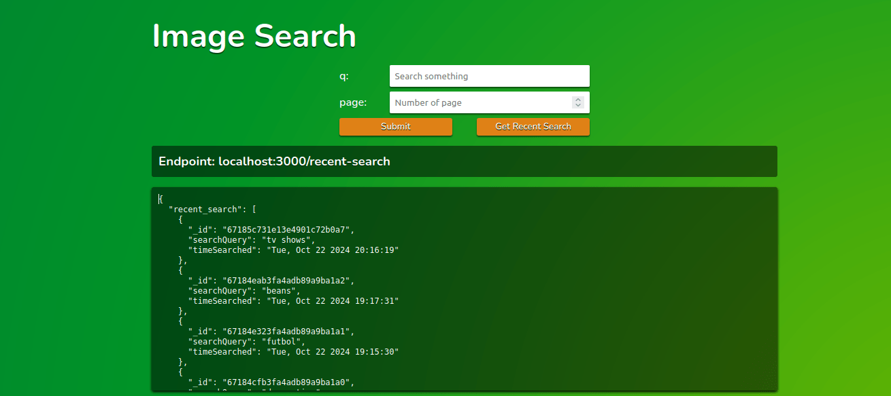

# freeCodeCamp task: Build an Image Search Abstraction Layer
***

- This app was created with javascript, express and mongodb.

- To search the images data, Custom Search JSON API is used. For more information check [Custom Search JSON API](https://developers.google.com/custom-search/v1/overview).

- Install dependencies with `npm install`.

- You must create a `.env` file in the root of the project with the data below:
    
    - ___PORT___ = *Port of server*
    - ___API_KEY_GOOGLE_SEARCH___ = *API key of Custom Search JSON API*
    - ___CX_GOOGLE_SEARCH___ = *Programmable Search Engine ID* 
    - ___MONGO_URI_CONNECTION___ = *Mongo URI Connection* 
- After doing all this, the app should work correctly.

